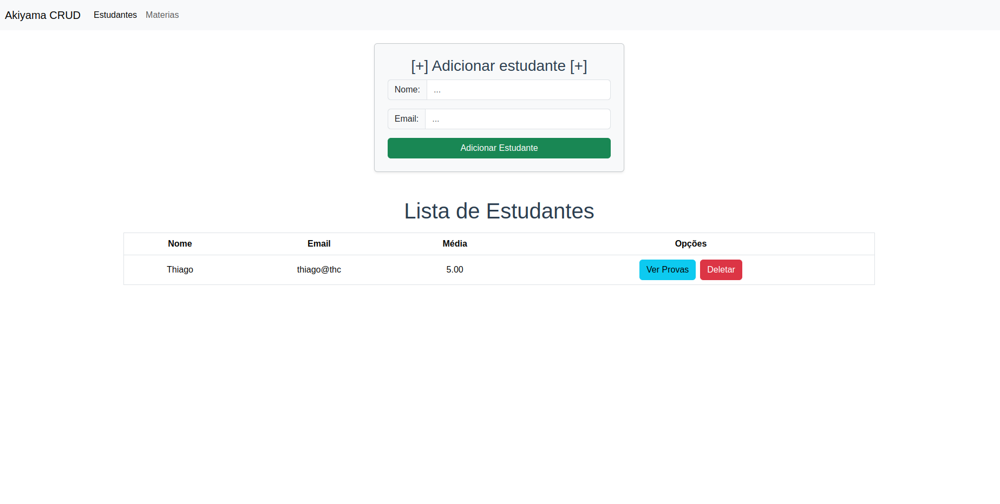
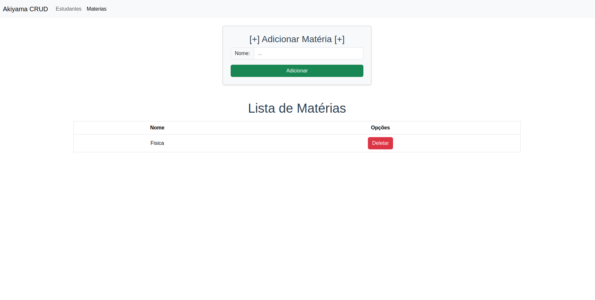
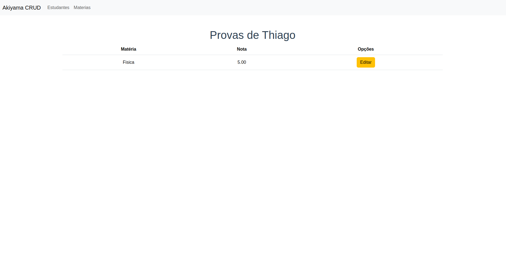

# Entrevista técnica - Akiyama

## Requisitos

- **Node e npm (LTS)**
  - ```https://nodejs.org/en```
- **PostgreSQL**
   - Windows:
     -  ```https://www.postgresql.org/download/```
  -  Linux:
     -  ```sudo apt install postgresql postgresql-contrib```
- **Vue**
  - ```npm install -g @vue/cli```

## Configurações

### PostgreSQL

Comandos de configuraçao do PostgreSQL no Linux:
```
sudo systemctl start postgresql 
sudo systemctl enable postgresql 
sudo -i -u postgres
ALTER USER postgres WITH PASSWORD 'nova_senha';
psql
CREATE DATABASE nome_do_banco;
\c nome_do_banco
\q
```
Tome cuidado! 

Substitua **'nova_senha**' por uma senha segura, e **'nome_do_banco'** pelo nome dado ao banco. Essas informações serão utilizadas posteriormente ao configurar o arquivo **.env**.

### Backend
Para iniciar a configuração do backend acesse a pasta correspondente com o comando:
```
cd backend
```

Crie um arquivo com nome **.env** com as seguintes informações:
```
DB_USER=***
DB_PASSWORD=***
DB_HOST=localhost
DB_PORT=5432
DB_NAME=***
```

Substitua *** pelas informações configuradas no seu PostgreSQL


Se estiver no linux, pode utilizar o comando abaixo para criar o arquivo .env:
```
vim .env
```


Agora rode o comando abaixo para instalar as dependências:
```
npm install
```

Pronto, agora inicie o backend com o comando:
```
node server.js
```

### Frontend

Para configurar o frontend volte para a pasta raiz do projeto e acesse a pasta em questão com:
```
cd frontend
```

Agora instale as dependências com:
```
npm install
```

Agora, inicie o vue com:
```
npm run serve
```

### Orientaçoes de uso:
Para acessar a página inicial, acesse: http://localhost:8080/.

Ao acessar o sistema pela primeira vez, todos os campos estarão vazios, e para testar suas funcionalidades, é sugerido criar novos Estudantes, Materias e Notas, respectivamente.

A tela inicial mostrará a lista de estudantes juntamente com um formulário de inserção.



Nessa tela você poderá criar, excluir ou acessar a página de notas do aluno.

Ao clicar na opção **Materias** no menu de navegação, você será direcionado à pagina de matérias, onde será possivel adicionar, excluir e visualizar todas as matérias.



Para acessar á página de notas do aluno é necessário voltar para a página de Estudantes, e selecionar o botão azul [Ver Provas] na linha do aluno desejado.

Assim você terá acesso à página de provas, que apresentará uma listagem de todas as matérias cadastradas e respectivamente as notas do aluno em questão.



Você podera adicionar uma nota, editar ou excluir um nota.

Sempre que uma nota for atualizada, a média do aluno será atualizada na página de Estudantes.

## Observações
- O projeto foi desenvolvido em apenas 2 horas, e para otimizar o tempo, optei por utilizar o bootstrap para auxiliar com a estilização, desenvolvendo um sistema *sem* CSS.
- **Estudantes** e **Materias** não podem ser editados pelo frontend! Deixei sem essa função no frontend, mas as rotas do backend estão prontas para uso, inclusive foram testadas no Postman. 
- Se sentir a necessidade de avaliar mais alguma skill, não exite em entra em contato!